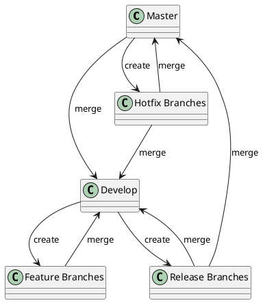

# GitFlow Workflow 🌳

GitFlow es una estrategia de ramificación de Git que ayuda a gestionar el desarrollo de manera estructurada. A continuación, te explicamos cómo funciona el flujo de trabajo con GitFlow y cómo utilizarlo en tu proyecto.

## Flujo de Trabajo Local con GitFlow 🌍

### 1. **Configuración Inicial 🛠️**

Antes de empezar a usar GitFlow, necesitas inicializarlo en tu repositorio. Ejecuta el siguiente comando en tu terminal:

```bash
git flow init
```

Este comando configura las ramas principales (`master` y `develop`) y las ramas de soporte (feature, release, hotfix).

### 2. **Ramas Principales 🧭**

GitFlow utiliza dos ramas principales para gestionar el desarrollo:

#### **Master 🏅**
- **Descripción:** Contiene el código de producción. Aquí se encuentran las versiones estables y liberadas del proyecto.
- **Uso:** No debes hacer commits directamente a esta rama. Los cambios se fusionan desde otras ramas.

#### **Develop 🚀**
- **Descripción:** Contiene el código de desarrollo. Aquí se integran todas las características antes de ser liberadas.
- **Uso:** Los desarrolladores hacen commits en esta rama durante el ciclo de desarrollo.

### 3. **Ramas de Soporte 🛠️**

#### **Feature Branches 🌟**
- **Descripción:** Se utilizan para desarrollar nuevas funcionalidades. Se crean a partir de la rama `develop` y se fusionan de nuevo a `develop` cuando se completa la funcionalidad.
- **Creación:** 
  ```bash
  git flow feature start <feature-name>
  ```
- **Finalización:** 
  ```bash
  git flow feature finish <feature-name>
  ```

#### **Release Branches 🚀**
- **Descripción:** Se utilizan para preparar una nueva versión de producción. Se crean a partir de `develop` cuando se decide que es el momento de lanzar una nueva versión.
- **Creación:** 
  ```bash
  git flow release start <version>
  ```
- **Finalización:** 
  ```bash
  git flow release finish <version>
  ```

#### **Hotfix Branches 🔥**
- **Descripción:** Se utilizan para corregir errores críticos en producción. Se crean a partir de `master` y se fusionan en `master` y `develop` una vez que se resuelve el problema.
- **Creación:** 
  ```bash
  git flow hotfix start <hotfix-name>
  ```
- **Finalización:** 
  ```bash
  git flow hotfix finish <hotfix-name>
  ```

### 4. **Diagrama de Flujo 🌐**

Aquí tienes un diagrama visual que ilustra cómo interactúan las diferentes ramas en GitFlow. 



### 5. **Flujo de Trabajo en GitFlow 🏗️**

#### **Desarrollo de Nuevas Funcionalidades:**
1. **Crear una Rama de Funcionalidad:**
   ```bash
   git flow feature start <feature-name>
   ```
2. **Desarrollar y Hacer Commits:**
   Trabaja en la funcionalidad, realiza commits frecuentes y asegura que el código está en el estado correcto antes de fusionarlo.
   ```bash
   git add .
   git commit -m "Describe your changes"
   ```
3. **Finalizar la Rama de Funcionalidad:**
   ```bash
   git flow feature finish <feature-name>
   ```

#### **Preparación para un Lanzamiento:**
1. **Crear una Rama de Liberación:**
   ```bash
   git flow release start <version>
   ```
2. **Realizar Ajustes Finales y Correcciones:**
   Haz commits según sea necesario:
   ```bash
   git add .
   git commit -m "Final adjustments for release"
   ```
3. **Finalizar la Rama de Liberación:**
   ```bash
   git flow release finish <version>
   ```

#### **Corrección de Errores Críticos:**
1. **Crear una Rama de Corrección:**
   ```bash
   git flow hotfix start <hotfix-name>
   ```
2. **Corregir el Error y Hacer Commits:**
   ```bash
   git add .
   git commit -m "Fix critical issue"
   ```
3. **Finalizar la Rama de Corrección:**
   ```bash
   git flow hotfix finish <hotfix-name>
   ```

### 6. **Sincronización con el Repositorio Remoto 🌐**

Antes de comenzar nuevas ramas o después de finalizar ramas, asegúrate de sincronizar tu repositorio local con el remoto:

- **Actualizar tu rama local `develop` con los últimos cambios del remoto:**
  ```bash
  git checkout develop
  git pull origin develop
  ```

- **Subir tus cambios al repositorio remoto después de finalizar una rama:**
  ```bash
  git push origin develop
  git push origin master
  ```

### 7. **Buenas Prácticas 🔍**

- **Mantén ramas pequeñas y enfocadas:** Esto facilita la revisión y fusión de cambios.
- **Realiza merges frecuentes con `develop`:** Mantén la integración continua y evita conflictos grandes.
- **Usa descripciones claras en tus commits:** Facilita la comprensión del propósito de cada cambio.
- **Revisa tu código antes de hacer merge:** Asegúrate de que todo funciona correctamente y que el código es revisado por otros miembros del equipo.
- **Sincroniza frecuentemente:** Mantén tu rama local actualizada con los cambios del repositorio remoto para evitar conflictos.
