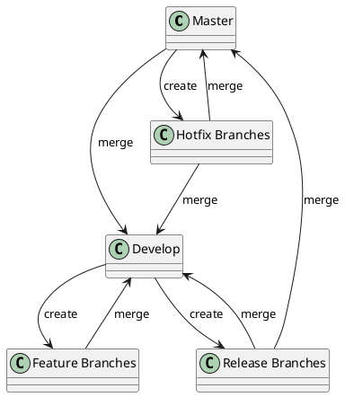

# GitFlow Workflow 🌳

GitFlow is a branching strategy for Git that helps manage development in a structured way. Here's a simple guide on how GitFlow works and how to use it in your project.

## Local Workflow with GitFlow 🌍

### 1. **Initial Setup 🛠️**

Before using GitFlow, initialize it in your repository by running:

```bash
git flow init
```

This command sets up the main branches (`master` and `develop`) and support branches (feature, release, hotfix).

### 2. **Main Branches 🧭**

GitFlow uses two main branches for development:

#### **Master 🏅**
- **Description:** Contains production code. It holds stable, released versions of the project.
- **Usage:** Do not commit directly to this branch. Changes are merged from other branches.

#### **Develop 🚀**
- **Description:** Contains development code. All features are integrated here before being released.
- **Usage:** Developers commit to this branch during the development cycle.

### 3. **Support Branches 🛠️**

#### **Feature Branches 🌟**
- **Description:** Used to develop new features. Created from `develop` and merged back into `develop` when done.
- **Create:** 
  ```bash
  git flow feature start <feature-name>
  ```
- **Finish:** 
  ```bash
  git flow feature finish <feature-name>
  ```

#### **Release Branches 🚀**
- **Description:** Used to prepare a new production release. Created from `develop` when ready for a new version.
- **Create:** 
  ```bash
  git flow release start <version>
  ```
- **Finish:** 
  ```bash
  git flow release finish <version>
  ```

#### **Hotfix Branches 🔥**
- **Description:** Used to fix critical issues in production. Created from `master` and merged into both `master` and `develop` once fixed.
- **Create:** 
  ```bash
  git flow hotfix start <hotfix-name>
  ```
- **Finish:** 
  ```bash
  git flow hotfix finish <hotfix-name>
  ```

### 4. **Flow Diagram 🌐**

Here's a visual diagram showing how the different branches interact in GitFlow.



### 5. **GitFlow Workflow 🏗️**

#### **Developing New Features:**
1. **Create a Feature Branch:**
   ```bash
   git flow feature start <feature-name>
   ```
2. **Develop and Commit:**
   Work on the feature, make frequent commits, and ensure the code is ready before merging.
   ```bash
   git add .
   git commit -m "Describe your changes"
   ```
3. **Finish the Feature Branch:**
   ```bash
   git flow feature finish <feature-name>
   ```

#### **Preparing for a Release:**
1. **Create a Release Branch:**
   ```bash
   git flow release start <version>
   ```
2. **Make Final Adjustments and Fixes:**
   Commit as needed:
   ```bash
   git add .
   git commit -m "Final adjustments for release"
   ```
3. **Finish the Release Branch:**
   ```bash
   git flow release finish <version>
   ```

#### **Fixing Critical Issues:**
1. **Create a Hotfix Branch:**
   ```bash
   git flow hotfix start <hotfix-name>
   ```
2. **Fix the Issue and Commit:**
   ```bash
   git add .
   git commit -m "Fix critical issue"
   ```
3. **Finish the Hotfix Branch:**
   ```bash
   git flow hotfix finish <hotfix-name>
   ```

### 6. **Sync with Remote Repository 🌐**

Before starting new branches or after finishing branches, make sure to sync your local repository with the remote:

- **Update your local `develop` branch with the latest changes from remote:**
  ```bash
  git checkout develop
  git pull origin develop
  ```

- **Push your changes to the remote repository after finishing a branch:**
  ```bash
  git push origin develop
  git push origin master
  ```

### 7. **Best Practices 🔍**

- **Keep branches small and focused:** This makes code review and merging easier.
- **Merge frequently with `develop`:** Maintain continuous integration and avoid large conflicts.
- **Use clear commit messages:** Helps understand the purpose of each change.
- **Review code before merging:** Ensure everything works correctly and get feedback from team members.
- **Sync regularly:** Keep your local branch updated with changes from the remote repository to avoid conflicts.